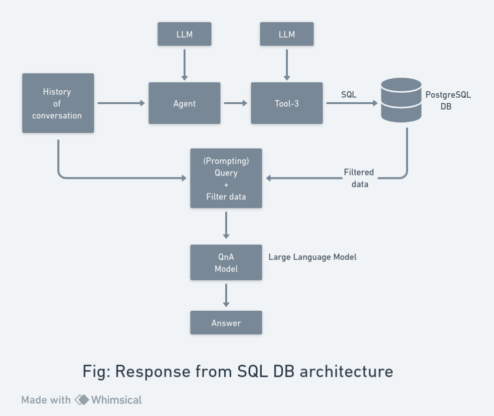

<!-- <div align="center> -->

# Solution Plan: Customized AI Assistant for Tour Planning and Booking

<!-- </div> -->

## Overview

Overview: An AI assistant for tour planning and booking is a software program that communicates with users naturally, understanding their preferences, making personalized tour recommendations, handling bookings, and providing customer support. It streamlines the process, saving time and effort, which enhances the overall customer experience.

Fine-tuning large language models like GPT-3 is a key approach to creating such assistants. This involves adding specific knowledge, like tour planning and booking information, to transform a general language model into a domain-specific AI assistant, making it proficient in understanding and generating content related to travel and accommodations.

Additionally, LangChain is an open-source framework that aids in developing applications based on language models, making it easier to build AI assistants. It simplifies the development process by offering a range of tools and components that allow developers to create unique applications centered around a language model, increasing the efficiency and effectiveness of AI assistant development.


The concept of an `Agent` within LangChain refers to a class that leverages a Large Language Model (LLM) to intelligently select a series of actions. Unlike predefined sequences found in chains, Agents rely on the language model's reasoning capabilities to decide on the most appropriate actions and their order. To accomplish this, Agents make use of `Tools` and `Toolkits` to execute actions. These `Tools` are specialized classes designed for customer interactions, each equipped with a descriptive profile. The Agent utilizes these descriptions to effectively identify and choose the suitable tool for a given task, enhancing its adaptability and decision-making process.

## Prospective Solution

 I've opted for the Langchain framework as the cornerstone for constructing the AI assistant for Booking.com, primarily due to its user-friendliness, robust capabilities, flexibility, and open-source nature. However, it's imperative to consider several crucial factors:

 **1. Natural Language Understanding:** The AI must proficiently comprehend and respond to natural language queries.

 **2. Database Integration:** It should efficiently tap into Booking.com's tour and accommodation database for up-to-date information.

**3. Personalized Recommendations:** The AI should have the ability to craft personalized travel recommendations tailored to individual customer preferences.

**4. Booking Facilitation:** The AI must be equipped to facilitate bookings for tours and accommodations seamlessly on behalf of customers.

In addition, to address these considerations we have identified corresponding tools within the Langchain agent framework:

***Tool-1:*** This tool is designed to adeptly respond to inquiries using the knowledge base vector database.

***Tool-2:*** Tailored specifically for answering queries by leveraging Booking.com's extensive database.

***Tool-3:*** Formulated to excel in generating tour package recommendations based on the nuanced preferences of customers.

***Tool-4:*** This tool serves as the conduit for initiating API calls, enabling the AI to efficiently book packages as per customer requests.


The architecture of the AI assistant operates as follows: Initially, customer queries are routed through an agent. The agent's LLM acts as the decision-making engine, determining which Tool from the tool list aligns with the customer query. This decision is made based on the descriptions and names of each tool. Once a tool is selected, it carries out its designated action. Subsequently, by harnessing the response provided by the tool and a predefined prompt, the entire prompt is channeled to a model. This model then processes the information to generate an appropriate response.

In the subsequent section, I will outline the actions of each tool in alignment with the architecture. Additionally, I will provide code excerpts that illustrate how each tool functions and what specific tasks it undertakes.

### Tool-1
This tool has been meticulously crafted to provide prompt and accurate responses to inquiries by utilizing the knowledge base vector database. It employs a specialized algorithm to search, retrieve, and present relevant information from the database, ensuring that customer queries are addressed effectively. The diagram snippet below exemplifies how this tool operates:


In this setup, we begin by storing a PDF document containing comprehensive information about booking.com in a vector database. Subsequently, when new queries are presented, these query embeddings are processed through a function that calculates their similarity with the stored vector data. Any relevant information identified through this similarity calculation is then forwarded to the LLM, enabling it to generate a contextually appropriate response to the query.
In the following section, I am scrutinizing a tool function that holds the potential to be an ideal fit for this particular tool.

```
from langchain.agents import Tool

tools = [

 	Tool(

 		name='Knowledge Base',
 		func = qa.run,
 		description = (
 		'use this tool when answering general knowledge about the booking.com')
 		
        )

]
```
The function `qa.run` is responsible for retrieving pertinent documents corresponding to customer queries. The significance of parameters such as description and name cannot be understated, as these elements play a pivotal role in the decision-making process of the agent's LLM. The agent's LLM utilizes the description and name to determine when this tool should initiate an action, ensuring an informed and contextually relevant response.

### Tool-2 
This tool has been tailor-made to excel in responding to queries by harnessing the extensive database maintained by Booking.com. It is finely tuned to search, retrieve, and provide precise information from this database in response to customer queries. The tool's design and functionality are optimized to ensure accurate and relevant responses, making it a valuable asset for handling inquiries related to Booking.com's offerings and services. The diagram snippet provided below serves as an illustrative representation of the operational workflow of this tool:


When a new query arises, the agent routes it through Tool-2 for inquiries about Booking.com's tour and accommodation information. Tool-2 uses the LLM to perform a database query, fetch relevant answers, and filter the information. This filtered data is then sent to the prompt engineering section, where it is combined with the query and passed through the model to generate the appropriate response.

```
from langchain.sql_database import SQLDatabase
from langchain.chains import SQLDatabaseChain


db =SQLDatabase(engine)
sql_chain = SQLDatabaseChain(llm= llm, database=db, verbose = True)

```

```
from langchain.agents import Tool


tools = [

    Tool(
            name='booking.com DB',
            func = sql_chain.run,
            description = (
            'Useful for when customers need to answer questions related to tour and accommodation information. '
            )
        )
]


```

Here, `db = SQLDatabase(engine)` This line initializes an SQLDatabase instance called db by providing an engine as a parameter. The engine likely represents the database connection settings. `sql_chain = SQLDatabaseChain(llm=llm,database=db, verbose=True)` I created an `SQLDatabaseChain` instance named sql_chain. This chain integrates the LangChain agent with the SQLDatabase and an LLM (Large Language Model). `tools = [...]` In this section, we define a list of tools available for the agent. The provided tool is named `booking.com DB` and is associated with the sql_chain.run function. The description provides context for when and how this tool should be utilized, which is when customers require answers related to tour and accommodation information on Booking.com.

### Tool-3
Designed to excel in generating personalized tour package recommendations tailored to each customer's specific preferences.


This architecture resembles Tool-2, but instead of relying on a single query, it analyzes conversational history to extract customer preferences such as destination choices, budget considerations, accommodation preferences, and flight preferences. Once equipped with this information, the tool executes an SQL query to the database, utilizing the gathered customer data. Leveraging the availability of the customer preference model, this tool then recommends the ideal travel package tailored to the customer's specific preferences.
```
from langchain.sql_database import SQLDatabase
from langchain.chains import SQLDatabaseChain


db =SQLDatabase(engine)
sql_chain = SQLDatabaseChain(llm= llm, database=db, verbose = True)


from langchain.agents import Tool


tools = [


Tool(
 		name='booking.com DB',
 		func = sql_chain.run,
 		description = (
 		'Useful for recommend packages to customer ',
		'To use this tool customer must provide three following parameter', 
        'destination choices, budget considerations, accommodation preferences, and flight preferences', 
		'After getting all information tool will recommend best packages to customer from availability from database'
 		)
 	)
]


```

Overall, this code snippet seems to set up a tool for a travel recommendation system, utilizing a database and possibly natural language processing capabilities to personalize travel package suggestions based on customer preferences.


### Tool-4
This tool acts as the pathway for triggering API calls, facilitating the AI in swiftly booking packages in accordance with customer requests. The diagram snippet provided below serves as an illustrative representation of the operational workflow of this tool:


Upon the emergence of a new query, the agent directs it through Tool-4, which handles the booking of tours and accommodations on Booking.com. The API's response is subsequently relayed to the prompt engineering section, where it is merged with the query and channeled through the model to produce the fitting response.

```
from typing import Optional


desc = (
"use this tool when customer need to book tour flight",
"To use this tool customer must provide three following parameter",
"from_: arrival location",
"to:depeature location",
"date:date to book flight",
"flight: specific flight name",
"['from','to','date','flight']"
)
```

```
class bookingTool(BaseTool):
 	name = "Call Booking API"
 	description = desc
 	api_url = "https://booking.com/book/" #example


 	def _run(self,
 		from_: Optional[Union[str]] = None,
 	    to: Optional[Union[str]] = None,
 		date: Optional[Union[str]] = None,
 		flight: Optional[Union[str]] = None):


 		params= {
 		'from':from,
 		'to' : to,
 		'date' : date,
 		'flight' : flight
 		}


 		response = requests.get(self.api_url , params=params)
 		return response


tools = [bookingTool()]


```

In this code snippet, we are defining a Python class called `bookingTool` that represents a tool for interfacing with a booking API to book tours and flights on Booking.com. Let's break down the key elements:
Description (`desc`) A description is provided as a tuple (`desc`) to explain how to use this tool. It specifies the parameters required for booking a flight, such as arrival and departure locations, date, and specific flight name. `bookingTool` Class Definition This class inherits from `BaseTool` and defines the tool's functionality. Key components of the class are as follows `name` Specifies the tool's name as "call Booking API." `description` Describes the tool and its usage, based on the information provided in the `desc` tuple. `api_url`: Sets the API endpoint URL (e.g.,"https://booking.com/book/") for making flight bookings. The `_run` method of the class defines how the tool operates when called. It takes optional parameters like `from_`, `to`, `date`, and `flight`, which are used to construct API request parameters. The tool then sends an HTTP GET request to the specified API URL with the provided parameters. 
Overall, this code defines a tool for booking tours and flights on Booking.com by making API requests with the required parameters. Users can utilize this tool by providing the necessary information to book their desired flight.


Now, let's bring everything together in a simple way. We have a variety of tools, and we want to create a unified prompt system where the model responds like a real assistant. It's crucial to note that the model's responses should primarily rely on the tools at hand, ensuring the model acts as an assistant by utilizing these tools for accurate and context-aware answers.

```
sys_msg = """
You are an AI assistant of booking.com.
Your role is to help customers to plan and book tours from booking.com.
you always refer to trusty tools and absolutely do NOT try to answer on your own.
"""


new_prompt = agent.agent.create_prompt(
system_message = sys_msg,
tools = tools
)


agent.agent.llm_chain.prompt = new_prompt

```
The new_prompt is created by combining the system message (sys_msg) with the list of tools (tools) available to the assistant.

Finally, the prompt for the LangChain agent is updated with this new configuration, ensuring that the AI assistant operates within the specified guidelines and leverages the provided tools for its responses.

## Key Considerations for building a robust AI assistant
1. Scalabillity: 
    - Implement Load Balancing Techniques for Optimal Performance 
    - Use a serverless architecture (e.g., AWS Lambda, Azure Functions).
    - Implement microservices for task-specific scaling.
2. Cost-effectiveness:
    - Integrate LoRa and PRMF Technologies for Enhanced Training
    - Utilize serverless computing to pay only for actual usage.
    - Implement caching to reduce redundant requests.
    - Use a content delivery network (CDN) for static content.
3. High Request Handling Capacity:
    - Implement message queuing (e.g., Amazon SQS) for efficient request processing.
    - Use microservices for independent scaling.
4. Data Privacy protection & security
    - Train open-source Large Language Model for domain specific task such as llama-2, Falcon
    - 


